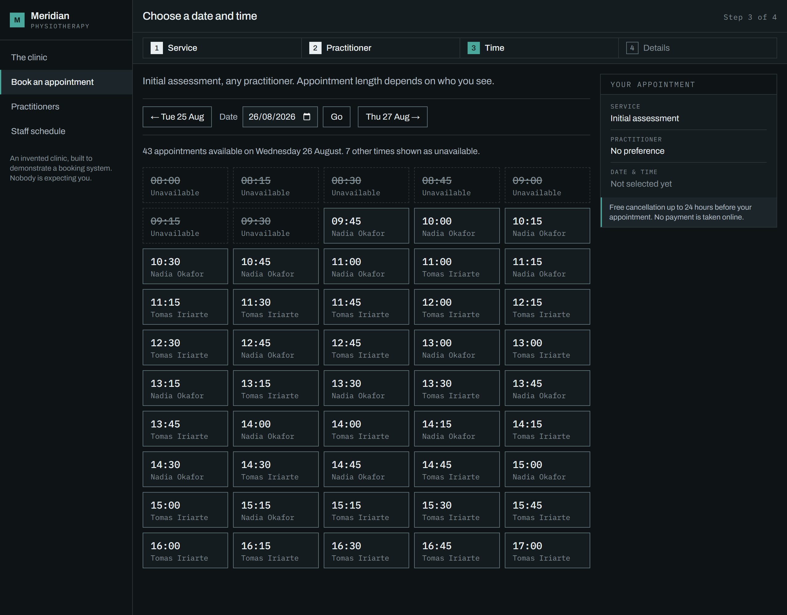
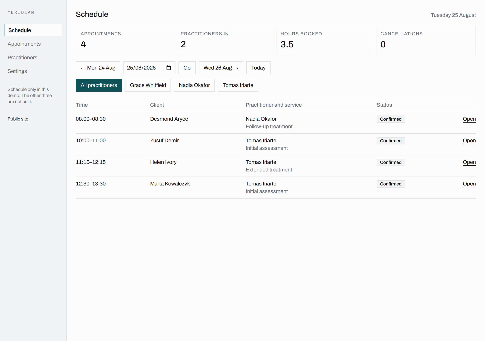

# Meridian

A booking platform for a multi-practitioner physiotherapy clinic. Three practitioners with
genuinely different working patterns, five appointment types, and an availability engine that
has to reconcile them without ever double-booking anybody.

**Live:** https://meridian-rosy.vercel.app

Meridian is an invented clinic and the practitioners are fictional. It is one of my own demo
builds, not client work — there is no real Nadia Okafor, and nothing on the site is a
photograph or a generated image.



Next.js 16 (App Router, server actions) · TypeScript · Postgres on Neon · Drizzle with
migrations checked in · Tailwind v4 · Vitest · Resend for the confirmation email.

---

## Lighthouse

Lighthouse 13.4.1, mobile preset, run against the deployed URL rather than a local build.
Five runs per page, and the table quotes **the lowest of the five**, not the median and not
the best.

| | Performance | Accessibility | Best practices | SEO | Agentic Browsing |
|---|---|---|---|---|---|
| `/` — the clinic | **99** | **100** | **100** | **100** | **100** |
| `/book/initial-assessment/any` — the booking grid | **99** | **100** | **100** | **100** | **100** |

Measured 25 August 2026. The runs behind those two numbers were 100, 99, 99, 99, 99 on the
homepage and 100, 99, 100, 100, 99 on the grid — medians of 99 and 100, which is what this
table used to quote. It quotes the worst run now instead. A median hides one bad run in five
by construction, and the run somebody else gets when they open the link is drawn from the
whole distribution rather than from the middle of it.

CLS is **0** on both, across all ten runs and separately across forty runs of `npm run
measure`, which is the number a layout change is most likely to cost you and the one I check
first. Worst-of-five LCP is 2.20 s and 2.15 s; worst-of-five TBT is 20 ms and 15 ms; time to
first byte is 13 ms and 12 ms.

Five runs rather than three because performance is the one category that will not sit still
here, on a page whose LCP is a paragraph of text — the two seconds is render delay under
Lighthouse's simulated mobile throttling, not the server. Every page that touches the
database is rendered per request; there is no static cache doing that work.

The previous version of this table quoted 97 and 99 as medians, with TBT at 88 ms and 80 ms,
measured on 24 August against the deployment before the error-boundary and
database-fallback work. Both pages score higher now and TBT is roughly a fifth of what it
was. I am not going to claim credit for that: nothing in that change set was a performance
change, the two measurements are a day apart on a hobby tier, and the honest reading is that
some of the earlier figure was the afternoon rather than the build. What is safe to say is
that the numbers above are the ones the deployed build produces today, and that they are the
floor of five runs rather than the middle.

Agentic Browsing is the fifth category in Lighthouse 13, replacing PWA. It scores what an
agent rather than a person can make of the page: the accessibility tree it would have to
navigate, layout stability, and whether the site publishes an
[llms.txt](https://meridian-rosy.vercel.app/llms.txt). Meridian's carries the
service list out of the database rather than a hand-written summary that would drift the
first time a price changed, and its first paragraph says the clinic is invented — an agent
acting for somebody who actually needs a physiotherapist should be able to tell in one line
and stop.

---

## The availability engine

`getAvailability()` is a pure function over a bundle of rows. It opens no connection, reads no
clock and holds no state; `now` is an argument, because lead time is one of the rules and a
function that reads the system clock cannot be tested without either freezing time globally or
waiting for it. That is why there are twenty unit tests over fixtures and no database
anywhere near them.

The rules it applies, in order: the practitioner offers the service at all; they have working
hours on that weekday; **the appointment's duration is theirs, not the service's**; slots sit
on a fifteen-minute grid while appointments run 30, 45 or 60 minutes; the whole appointment
must end on or before the end of the working day; it must not overlap a confirmed booking or a
period of leave; and it must start at least two hours from now and no more than sixty days out.

The third rule is the one that makes this more than a loop over a calendar.
`practitioner_service.duration_minutes_override` means an initial assessment is 45 minutes with
Nadia and 60 with Tomas. The same service therefore produces a different grid per practitioner,
a different last-bookable slot, and a different answer to "does this fit before closing?" on
the same day — Nadia's last assessment starts at 15:15 against her 16:00 close, and Tomas's at
17:00 against his 18:00. With "no preference" the engine runs all of that per practitioner and
unions the results, each slot tagged with whoever is free for it, so two people free at 10:00
are two bookable appointments rather than one.

It also returns the times that exist on the grid but **cannot** be taken, which is a different
question and the one the interface actually needs. A grid rendered only from free times
collapses two facts into one silence: 16:00 on a Thursday being taken and 16:00 on a Friday not
existing both arrive as an absence, and somebody hearing the page read aloud cannot tell a busy
day from a short one. Blocked positions come back with a reason. Times beyond the sixty-day
horizon do not — a date the clinic is not open for bookings yet is a closed day, not a full one.

Two details worth naming. The engine cannot distinguish an appointment from a study day, since
both are only "this practitioner is not free between these two instants" — and the interface
says "Unavailable" rather than "Booked" for exactly that reason, because which of the two it is
belongs to the clinic and not to whoever is looking for a Tuesday. And "next available" on each
practitioner card on the homepage runs the same engine: one wide read of a fortnight of rota,
bookings and leave, then the engine replayed against it in memory, day by day. Forty-two runs
over arrays of a few dozen items, against the forty-two database round trips the obvious
version would take. It is cached for a minute and dropped immediately by `updateTag` when a
booking or a cancellation changes the answer, so the homepage cannot contradict the diary it
just wrote to.

---

## Concurrency

**This is the section worth reading.** An application-level "is this slot free?" check is not a
guarantee and cannot be made into one. Two requests can both pass it before either inserts; the
gap between the read and the write is where the double booking lives, and no arrangement of
application code closes that gap without serialising every booking in the clinic through a
single lock. So the guarantee is in the database, where the write *is* the check:

```sql
CREATE EXTENSION IF NOT EXISTS btree_gist;

ALTER TABLE "booking"
  ADD CONSTRAINT "booking_no_overlap"
  EXCLUDE USING gist (
    "practitioner_id" WITH =,
    "during" WITH &&
  ) WHERE ("status" = 'confirmed');
```

`during` is a generated column, `tstzrange(starts_at, ends_at, '[)')`. The half-open bound is
load-bearing: a 10:00–11:00 appointment abuts an 11:00–12:00 one rather than colliding with it,
and the availability engine uses the same bound so that what is offered and what is accepted
cannot disagree. The `WHERE status = 'confirmed'` clause is what makes cancellation free the
slot — a cancelled row leaves the index entirely, and no history is deleted to achieve it.
`btree_gist` is what allows one gist index to mix an equality column with a range column.

`src/booking/create.ts` deliberately contains **no** availability check. It inserts, and turns
SQLSTATE `23P01` into a clean `slot_taken` result rather than a 500. The engine still decides
what to *offer*; it is not what makes the offer safe.

The test that proves it fires eight `createBooking` calls at one practitioner and one instant
through `Promise.all`, on eight separate connections — `postgres-js` pipelines on a single
connection by default, which would have the driver serialising the writes and the test proving
nothing. It asserts exactly one winner, seven `slot_taken` losers, and then asks the database
whether it agrees: one confirmed row, one audit row, seven aborted transactions that left
nothing behind. A second test does the same with `createBooking` taken out of it — eight raw
inserts, no read of any kind beforehand — because that is the shape a system with the check in
application code would have, and here it still cannot produce two overlapping rows.

One thing that only shows up under real load: Postgres does not always resolve the pile-up as a
clean exclusion violation. Eight transactions waiting on each other's speculative insertions
sometimes resolve as a deadlock, and the loser gets `40P01` instead of `23P01`. The row is still
never double-booked, but a write path that only knows about `23P01` turns that into a 500 under
exactly the load it was written for. `create.ts` retries on deadlock; by the retry the winner
has committed and the conflict is an ordinary `23P01`.

It runs against a real Postgres, never a mock. A mocked exclusion constraint asserts that a stub
returns what the stub was told to return, and would pass against a schema with no constraint on
it at all. `npm run db:up && npm run db:migrate && npm test`. Without a database those three
files skip rather than fail, printing what is going unproven — except under `CI=1`, where an
unreachable database is a broken pipeline rather than a local convenience.

---

## When the database is not there

This runs on Neon's free tier, which suspends its compute when idle. A cold first request has
a real chance of finding nothing at the other end, so that is a designed state rather than an
exception: every route resolves its own queries and renders a page saying the database is
waking up, with a link that retries. Stop the container and load all twelve routes and none of
them reaches the framework's error handler. The two non-HTML routes answer **503 with
`retry-after`** rather than 500 — a calendar client told 404 has been told the appointment is
gone, and an agent told 500 has been told the site is broken.

**There is no `loading.tsx` and no `Suspense` anywhere, and that is the interesting part.**
The obvious way to do this is a streamed fallback, and it breaks the thing this build cares
about most. With a `loading.tsx` on `/staff` and JavaScript disabled, the page renders 38
characters — the fallback — and stops: the real schedule is in the response, sitting inside a
`<div hidden>` waiting for an inline script that will never run. Without it the same page
renders 541 characters of real content. A fallback that hides the page from exactly the
readers it was meant to help is worse than no fallback, so the resolution happens before
anything is returned.

**The booking POST does not get the same promise as a read.** A read that fails can offer
"try again" safely because nothing was written. A booking has three failure points and they
are not equivalent: before the insert nothing was written and the message says so; after it
the appointment exists and the remaining work — the email, the audit row — is best effort and
is not allowed to turn a committed booking into an error page. Between those is the connection
dying mid-`COMMIT`, where the appointment either exists or does not and this process cannot
find out which. Guessing there is what sends somebody to book a second appointment, so it does
not guess. It says the state is unknown, points at the grid — a confirmed booking removes its
time — and says plainly that retrying is safe.

That last claim is not reassurance, it is the exclusion constraint again. A retry that finds
the first write did land is refused by Postgres and comes back as `slot_taken`. Two confirmed
appointments in one slot is not something the application has to avoid; it is something the
table cannot hold.

There is a `not-found.tsx`, an `error.tsx` and a `global-error.tsx`. The 404 will not tell you
whether a booking reference exists — the reference is the only credential in the build, and a
page that answers "does MRD-4K2P exist?" differently from "does MRD-4K2Q exist?" is an
enumeration oracle over other people's appointments.

---

## Timezones

Every instant is stored as `timestamptz` and rendered in `Europe/London`. Working hours are the
exception and are deliberately `time`, not timestamps: a practitioner works 09:00–17:00, and
works those hours on the day the clocks change too. Storing an offset there would silently shift
everybody's working day by an hour twice a year.

The wall-clock hours are resolved against the clinic's zone *at the instant in question*, by
asking the platform's IANA database rather than assuming an offset. There is a test for the
October 2026 transition: Nadia works 08:00–16:00 on Thursday 22 October and on Monday 26
October, and it asserts both that the first slot reads 08:00 on both days and that those two
slots are `07:00Z` and `08:00Z` respectively. The same wall clock, an hour apart in absolute
time. A fixed-offset implementation passes the first assertion and fails the second, and nothing
else in the suite would notice. The seed puts a real booking on each side of that weekend.

`instantFromWallClock` also has to answer for the spring-forward morning, where a wall-clock
hour does not exist. It rounds forward rather than throwing — no working day here starts inside
the gap, and a booking engine that raises twice a year is worse than one that rounds.

---

## Accessibility

The date and time picker is where this gets tested, and where most booking sites fail.

Every grid position is a real `<button>`, **including the ones that cannot be taken**. Blocked
times are rendered, focusable, marked `aria-disabled` and saying so out loud. The `disabled`
attribute would have removed them from the tab order along with the fact that they exist, which
is the information they are there to carry. `aria-disabled` means they have to be stopped some
other way, and not with a JavaScript handler — `type="button"` does it in the markup, so a
booked slot is inert whether or not a script loaded.

The grid is a `listbox`, and the role is load-bearing rather than decoration. It began as a
`<ul>` of buttons with a roving `tabindex`: Tab reaches it once, arrow keys move within it,
Enter selects. Thirty-two quarter-hours is otherwise thirty-two tab stops. That works for
somebody looking at the screen — and **it did not work at all for anybody using NVDA**, which
is the thing sitting with headphones on found and no automated check did. Without a composite
role a screen reader has no reason to leave browse mode, where the arrow keys belong to *it*
and never reach the page. The transcript of the old build is unambiguous:

```
'08:00UnavailableWednesday 26 August, not available', 'button', 'unavailable'
Right → CharacterModeCommand(True), '8'
Right → 'colon'
Up    → 'out of list', 'out of form'
```

Right arrow read the character "8", then the colon. One tab stop that a screen reader user
could enter and then not move within. With `role="listbox"` on the container and `role="option"`
on each slot, NVDA switches to focus mode on entry and hands the keys over:

```
Tab   → '08:00, Unavailable, Wednesday 26 August',            'unavailable',  '1 of 30'
Right → '08:15, Unavailable, Wednesday 26 August',            'unavailable',  '2 of 30'
Down  → '10:00, 45 minutes, with Nadia Okafor, Wed 26 August','not selected', '9 of 30'
```

Position and state come free with the role — *"9 of 30"* tells somebody how much day is left,
which the old markup could not say. The slots are still `<button type="submit">`, so the
no-JavaScript path is untouched; the role is what the accessibility tree sees, not the browser.

The names in that first transcript are the second thing listening found. *"08:00Unavailable"* —
the time welded to the word after it, because a name computed from three block elements gets no
spaces between them. `SlotGrid.tsx` carried a comment asserting that Chrome inserts one. It does
not. Every slot in this build had been announcing as one nonsense token since the day it was
written, my own sweep printed the evidence on every run, and nothing flagged it because the
sweep asserts a name *exists* and never asks whether it is sayable. Each slot now carries an
explicit `aria-label` with the visible text inside it, so WCAG 2.5.3 still holds for anybody
driving the page by voice. The same defect had the brand reading as *"MeridianPHYSIOTHERAPY"*
and the step indicator as *"1Service— completed"*; both are now spoken as written.

The row width is measured from the layout rather than assumed, because the grid reflows with the
viewport and Up has to mean up on a phone. Changing the date replaces the grid without moving
focus, so the result is announced through `aria-live="polite"` — *"18 appointments available on
Wednesday 26 August. 12 other times shown as unavailable."*

The whole flow works with JavaScript off. Each slot is a submit button with a `formaction`, so
selection is an ordinary navigation to a URL that carries the choice; the client component adds
the arrow keys and an optimistic fill on top of that rather than replacing it.

The palette is dark, and three of its tokens were changed before it shipped. The brief
specified `--color-muted: #7E8C92`. It clears 4.5:1 on the page ground and on the panel
surface — and lands at **4.497:1** on `--color-surface-2`, which is the fill behind every
hovered table row and every unavailable slot. Three thousandths under, and still a failure.
`--color-cancelled` was worse: `#C4635C` is 4.71:1 on the ground and 3.93:1 on surface-2, and
the ground is the one place a cancellation never appears — it is read in the schedule table,
and in that table's hover state. Both were lightened along their own hue until they cleared on
all three grounds rather than swapped for something safer, because the direction came from the
brief and what failed was arithmetic rather than taste.

The third is not a text colour at all. `--color-line-strong` draws the border on slot buttons,
filter chips and text inputs, and at the specified `#3A464B` it is 1.77:1 against the surface
behind it. The text inside those controls is legible either way; the border is what says the
thing *is* a control, which is what WCAG 1.4.11 asks 3:1 of — and neither axe nor Lighthouse
checks that, so nothing would have failed. Raised until it clears at 3.01:1 on its worst
ground. Every ratio is computed rather than estimated, and each one is recorded in the comment
beside its token in [`app/globals.css`](app/globals.css).

`tools/a11y-sweep.mjs` is the first mechanical half of the pass. It drives headless Chrome over the
DevTools protocol, tabs each page the way a keyboard user would, and reads accessible names out
of Chrome's own accessibility tree rather than guessing from `textContent` — those two disagree
exactly around visually-hidden spans and block children, which is precisely how the slot buttons
are built.

It runs every page twice, at 1280 and again at 360 with touch emulation on — the second width
is not cosmetic, because the controls here size themselves behind `pointer: coarse` and a desk
viewport cannot see what a thumb gets. The narrow pass also looks for content wider than the
viewport with no ancestor that scrolls to it, and for `overflow-x: auto` regions a keyboard
cannot reach. Neither asks whether the *document* scrolls, which is the wrong question:
`documentElement.scrollWidth` reads 609 on a 390px `/staff` while `window.scrollX` never
leaves 0.

Current run over eight pages: **no axe violations at either width**, no unnamed tab stop, no
tab stop without a focus ring, no target below its WCAG minimum, nothing unreachable, one tab
stop per grid, and a skip link that moves focus into `<main>` rather than merely scrolling to
it.

`tools/nvda-pass.ps1` is the second. It starts NVDA against a scratch profile with the
`silence` synth, so every utterance is logged at DEBUG level without being spoken aloud, and
drives the page with `SendKeys` rather than through the DevTools protocol — CDP-synthesised
keys bypass the OS keyboard hook entirely, browse mode never engages, and a CDP-driven "NVDA
test" ends up testing something else. That distinction is not theoretical: it is exactly why the
grid's arrow keys passed every automated check and failed the moment a real one was pressed. It
refuses to run if Chrome cannot take the foreground, because NVDA reads the focused window and a
backgrounded run produces an empty transcript that looks exactly like a pass.

**It has now been listened to**, which is how the two defects above were found. Both were
invisible to axe, to Lighthouse and to my own sweep — one was a missing space in a computed
name, the other was an interaction model that a sighted keyboard user gets and a screen reader
user does not. Neither is the kind of thing a checker can see, and both were sitting in a build
whose README already claimed the slot grid as its strongest accessibility work.

Two things the process itself taught me, since they cost more than the fixes did. The harness
matched its browser window on the title containing "Meridian" — which also matches a Vercel
dashboard tab, so one run tabbed through somebody else's website and produced a transcript that
looked like a result. It now matches on the scratch profile in the process command line. And the
slot grid is at tab stop **fifteen**, not thirteen, because a native `<input type="date">` is
four stops in a real browser — day, month, year, picker — where CDP-synthesised Tab treats it as
one. Two of my earlier "the arrows do nothing" runs were pressing arrow keys while focus sat in
Chrome's toolbar. A test that drives the wrong window is worse than no test, because it answers
confidently.

---

## What is deliberately missing

**No authentication on `/staff`.** It is the front desk's view of everybody's day and it is
open to anyone with the URL. In production it needs a real session, role checks so a
practitioner sees their own diary rather than the clinic's, rate limiting, and an audit trail of
who looked at what. I left it out because the interesting part of that screen is the data
density and the day-list layout, and building a login that guards a fictional clinic proves
nothing the concurrency test has not already proved. `robots.txt` keeps crawlers out of it,
which is not the same as security and is not offered as such.

**An appointment is addressed by its reference.** `MRD-8F3K` is short enough to read down a
telephone and unguessable enough to be the only thing between a stranger and somebody's booking.
That is a trade, knowingly made for a demo. A real clinic would want an emailed magic link, or
the reference plus a matching surname.

**No payments, no accounts, no rescheduling, no SMS, no waiting lists.** Rescheduling is the one
I would build first, and it is not a small feature: done properly it is a cancel and a rebook
inside a single transaction, which means the exclusion constraint has to accept the new slot
before the old one is released, and getting that wrong loses somebody their appointment to free
a slot they then cannot rebook.

**The confirmation email is delivered to one address on purpose.** The booking form is public
and takes whatever email address is typed into it, so a demo that delivers to that address is a
demo that will email a stranger on request. Delivery is allowlisted to `DEMO_EMAIL_RECIPIENT`;
every other booking has the email **rendered on the confirmation page instead**, composed by
`composeConfirmationEmail` — the same function that builds the payload posted to Resend, so what
is shown on the page is the message rather than an illustration of it. Withheld is recorded in
`audit_log` as its own action rather than as a failure, because nothing went wrong. A real clinic
would verify a sending domain and drop the allowlist; that is a DNS record and a one-line change,
and it is not what this build is trying to prove. The send still fails soft either way: the
booking is committed before the email is attempted, and no appointment is ever lost because a
third party had a bad minute.

---

## Running it

```bash
npm install
cp .env.example .env          # DATABASE_URL, RESEND_API_KEY, DEMO_EMAIL_RECIPIENT
npm run db:up                 # Postgres 17 in Docker, on 5433
npm run db:migrate
npm run seed                  # idempotent
npm run dev                   # http://localhost:3002
```

```bash
npm test                      # 69 tests; 18 of them need the database
npm run a11y                  # keyboard and accessibility-tree sweep, at 1280 and 360
npm run contrast              # every palette pairing against its WCAG threshold
npm run measure               # CLS per route, five runs, worst reported
npm run nvda                  # captures what NVDA actually says (Windows)
npm run shots                 # regenerates docs/
```

`a11y`, `contrast` and `measure` all exit non-zero on a failure, and each has been checked
against a deliberately broken page — a checker that has never returned a finding is not
evidence of a clean build.

The seed builds three practitioners with deliberately different patterns — Nadia Mon–Thu
08:00–16:00 with a lunch block, Tomas Tue/Wed/Fri 10:00–18:00 with no lunch and an hour for the
assessment Nadia does in 45 minutes, Grace part-time on Mondays and Fridays — and scatters
around forty bookings unevenly across three weeks, including a nearly full day, a nearly empty
one, a few cancellations and one appointment on each side of the October DST boundary. Identical
schedules hide bugs.


